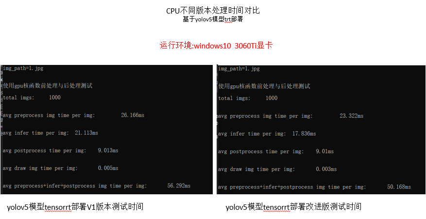
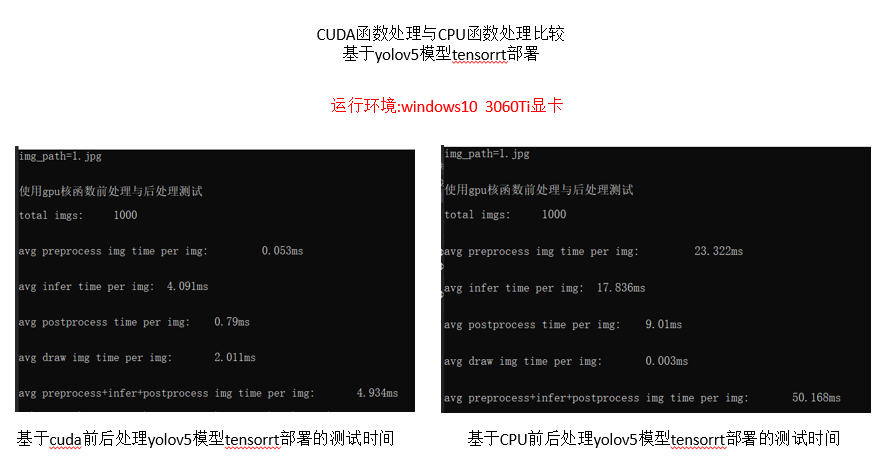

# onnx实现yolov5的tensorrt部署

  

# 工程目的
基于C++环境，yolov5模型采用onnx方式实现tensorrt部署

# 工程缺陷
模型前后处理采用cpu的C++方式实现，速度较慢，后期我有一份基于cuda编码处理数据代码，
链接:https://blog.csdn.net/weixin_38252409/category_12383040.html

# 文件说明
deploy_yolo_cpp:部署文件样列，已提供cmaklist.txt文件
yolo_cpp:主文件，最新优化部署文件，优化内存分配方式
yolo_cpp_v1:第一个版本文件，未做内存优化
yolov5-master:下载他人文件，yolov5官网转onnx出现问题时，使用此文件转换

# 测试结果对比
## cpu的2个版本对比

## cuda与cpu版本对比

### 对比可发现基于cuda编写速度提升约10倍！！
有需要可邮箱联系:511026664@qq.com
或点击链接:https://blog.csdn.net/weixin_38252409/category_12383040.html

# 相关测试文件链接
yolov5测试视频，测试结果，转换onnx文件等内容
链接：https://pan.baidu.com/s/1Fk74cj0gDomGLcS0hhGbgA 
提取码：yolo
或扫码提取：

 

